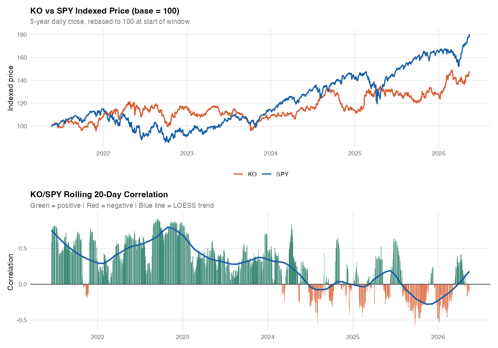
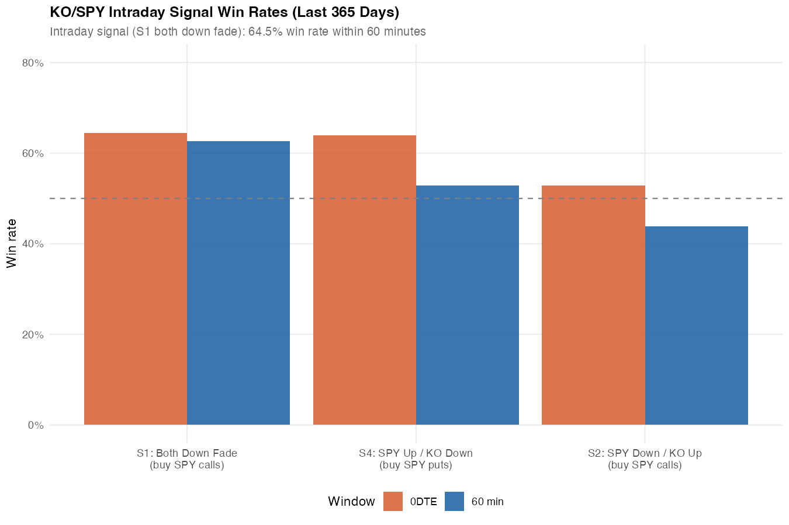

# ko-spy-signal

KO / SPY relationship research, with an emphasis on intraday divergence and fakeout-style setups.

The current version of the repo is centered on a tightened 1-year intraday backtest rather than the older broader six-signal scan. The goal is to use KO as a confirmation filter for SPY rather than treat the pair as a simple co-movement trade.

## Current takeaway

In the latest intraday version:

- The test window is the most recent `365` days.
- The signal set is reduced to `3` single-leg SPY setups.
- Thresholds were tightened to reduce noise and cut signal frequency materially.

The strongest setup in the current sample is:

- `S1_both_down_fade`
- Logic: SPY sells off sharply, KO does not confirm the move
- Expression: buy SPY calls
- Observed result in the refreshed run:
  - `62.6%` win rate over the next `60 minutes`
  - `64.5%` win rate by `0DTE`
  - positive average `0DTE` return

The refreshed hold-period read also improved:

- `1 DTE`: `56.3%`
- `2 DTE`: `67.1%`
- `3 DTE`: `67.1%`

That suggests the better use case may be identifying the cleaner intraday fakeout and then giving the SPY expression more time, rather than forcing a same-session exit every time.

## Repo structure

```text
ko-spy-signal/
├── Python/
│   ├── ko_spy_intraday.py   # main 1-year intraday backtest
│   ├── ko_spy_fakeout.py    # older intraday fakeout scanner
│   └── ko_spy_merged.py     # older multi-mode historical/intraday script
├── R/
│   └── ko_spyRegression.R   # daily regime study + chart generation
└── output/
    ├── ko_spy_charts.pdf
    └── charts/
        ├── price_correlation.png
        └── win_rate.png
```

## Main intraday signal definitions

The current backtest keeps only these three setups:

| Signal | Logic | Trade |
|---|---|---|
| `S1_both_down_fade` | SPY drops sharply and KO does not confirm | Buy SPY calls |
| `S2_spy_down_ko_up` | SPY weak, KO firm | Buy SPY calls |
| `S4_spy_up_ko_down` | SPY strong, KO weak | Buy SPY puts |

Current threshold settings in `Python/ko_spy_intraday.py`:

- `DROP_THRESHOLD_FULL = 0.005`
- `DROP_THRESHOLD_HALF = 0.003`
- `LOOKBACK_BARS = 6` (`30` minutes)

## Setup

### Python dependencies

```bash
pip install alpaca-py pandas numpy scipy tabulate pyarrow
```

### Environment

```bash
export ALPACA_API_KEY=your_key
export ALPACA_SECRET_KEY=your_secret
```

## Usage

### Main intraday backtest

```bash
python3 Python/ko_spy_intraday.py
```

This script:

- pulls KO and SPY intraday bars from Alpaca
- caches raw data in `ko_spy_cache/`
- evaluates the three active signal types
- reports:
  - signal counts
  - win rates by horizon
  - session breakdown
  - monthly frequency
  - DTE optimization
  - a signal export CSV

### Daily regime and chart script

```bash
Rscript R/ko_spyRegression.R
```

This script:

- studies the longer-run KO / SPY relationship using daily data
- builds the chart deck PDF
- regenerates:
  - `output/charts/price_correlation.png`
  - `output/charts/win_rate.png`

## Charts

### KO / SPY price relationship



### Current intraday win-rate view



## Notes and caveats

- This is research code, not production execution code.
- The strongest result in the current repo is the tightened `S1_both_down_fade` intraday setup.
- `S2` improved after threshold tightening because signal frequency dropped sharply, but it remains noisier than `S1`.
- The repo still contains older scripts (`ko_spy_fakeout.py`, `ko_spy_merged.py`) for reference. The current external-facing interpretation should be based on `ko_spy_intraday.py` and the regenerated charts.
- Option overlays involving short KO premium are still provisional and should be rechecked before being treated as a finalized trade structure.
